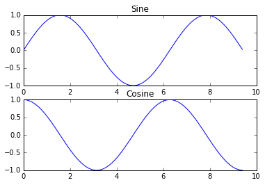

# Lecture 0: Python Tutorial

**Instructor:** Fei Tan

 @econdojo &nbsp;&nbsp;&nbsp;&nbsp;  @BusinessSchool101 &nbsp;&nbsp;&nbsp;&nbsp;  Saint Louis University

**Course:** Introduction to Neural Networks  
**Date:** August 27, 2025

---

## Software Setup

- **Working on cloud (recommended)**
  
  - [GitHub Codespace](https://github.com/codespaces), [Google Colaboratory](https://colab.research.google.com)
  - free access to hardware with preinstalled packages

- **Working on local machine**

<div class="code-box">

```bash
$ cd path/to/homework/directory
$ uv init        # initialize new project
$ uv add numpy   # create virtual environment and install numpy
$ uv run src/main.py   # sync dependencies and run script
$ python3        # enter interactive mode
```

</div>

---

## The Road Ahead

1. [Built-in Functionality](#built-in-functionality)
2. [External Packages](#external-packages)

---

## Basic Data Type: Numbers

<div class="code-box">

```python
x = 3
print(type(x)) # print "<class 'int'>"
print(x)       # print "3"
print(x + 1)   # addition; print "4"
print(x - 1)   # subtraction; print "2"
print(x * 2)   # multiplication; print "6"
print(x ** 2)  # exponentiation; print "9"
x += 1
print(x)       # print "4"
x *= 2
print(x)       # print "8"
y = 2.5
print(type(y)) # print "<class 'float'>"
print(y, y + 1, y * 2, y ** 2) # print "2.5 3.5 5.0 6.25"
```

</div>

---

## Basic Data Type: Booleans

<div class="code-box">

```python
t = True
f = False
print(type(t)) # print "<class 'bool'>"
print(t and f) # logical AND; print "False"
print(t or f)  # logical OR; print "True"
print(not t)   # logical NOT; print "False"
print(t != f)  # logical XOR; print "True"
```

</div>

---

## Basic Data Type: Strings

<div class="code-box">

```python
a = 'hello'    # single quotes string literals
b = "world"    # double quotes string literals
print(a)       # print "hello"
print(len(a))  # string length; print "5"
ab = a + ' ' + b  # concatenation
print(ab)      # print "hello world"
ab12 = f'{a} {b} {12}' # format
print(ab12)    # print "hello world 12"
print(a.capitalize())  # capitalize; print "Hello"
print(a.upper())       # uppercase; print "HELLO"
print(a.rjust(7))      # right-justify; print "  hello"
print(a.center(7))     # center; print " hello "
print(a.replace('l', '(ell)'))  # replace; print "he(ell)(ell)o"
print('  world '.strip())       # strip whitespace; print "world"
```

</div>

---

## Immutables

<div class="code-box">

```python
x = 5          # primitives/immutables (cannot be modified in-place)
y = x          # deep copy/pass by value
print(y is x)  # test if x and y refer to same object; print "True"
y = 10         # y points to new object
print(x)       # x is not affected; print "5"
print(y is x)  # x and y refer to different objects; print "False"
print(id(x))   # check address of int object (on heap) that x points to
print(id(y))   # x and y store different addresses
x += 1         # augmented assignment (+=, -=, *=, /=, etc.)
print(x)       # print "6"
print(id(x))   # x points to new object
```

</div>

---

## Container: Lists

<div class="code-box">

```python
xs = [3, 1, 2]    # create list (ordered)
print(xs[2])      # print "2"
print(xs[-1])     # negative index counts from list end; print "2"
xs[2] = 'foo'     # can contain different types
print(xs)         # print "[3, 1, 'foo']"
xs.append('bar')  # add new element to list end
print(xs)         # print "[3, 1, 'foo', 'bar']"
x = xs.pop()      # remove and return last element
print(x)          # print "bar"
```

</div>

---

## Container: List Slicing

<div class="code-box">

```python
nums = list(range(5))   # create list of integers
print(nums)             # print "[0, 1, 2, 3, 4]"
print(nums[2:4])        # slice from index 2 to 4 (exclusive); print "[2, 3]"
print(nums[2:])         # slice from index 2 to end; print "[2, 3, 4]"
print(nums[:2])         # slice from start to index 2; print "[0, 1]"
print(nums[:])          # slice of whole list; print "[0, 1, 2, 3, 4]"
print(nums[:-1])        # slice indices can be negative; print "[0, 1, 2, 3]"
nums[2:4] = [8, 9]      # assign new sublist to a slice
print(nums)             # print "[0, 1, 8, 9, 4]"
```

</div>

---

## Container: List Comprehension

<div class="code-box">

```python
animals = ['cat', 'dog', 'monkey']
for animal in animals:
    print(animal)  # print "cat", "dog", "monkey", each on its own line

nums = [0, 1, 2, 3, 4]
even_squares = [x ** 2 for x in nums if x % 2 == 0]  # list comprehension
print(even_squares)  # print "[0, 4, 16]"
```

</div>

---

## Container: Dictionaries

<div class="code-box">

```python
d = {'cat': 'cute', 'dog': 'furry'}  # create new dictionary (key-value pairs)
print(d['cat'])       # get entry; print "cute"
print('cat' in d)     # check if dictionary has a given key; print "True"
d['fish'] = 'wet'     # set entry
print(d['monkey'])    # KeyError: 'monkey' not a key of d
print(d.get('monkey', 'N/A'))  # get element with default; print "N/A"
print(d.get('fish', 'N/A'))    # print "wet"
del d['fish']         # remove element
print(d.get('fish', 'N/A'))    # "fish" is no longer a key; print "N/A"
```

</div>

---

## Container: Dictionary Comprehension

<div class="code-box">

```python
d = {'person': 2, 'cat': 4, 'spider': 8}
for animal in d:
    legs = d[animal]
    print(f'A {animal} has {legs} legs')
# print "A person has 2 legs", "A cat has 4 legs", "A spider has 8 legs"

nums = [0, 1, 2, 3, 4]
even_num_to_square = {x: x ** 2 for x in nums if x % 2 == 0}
print(even_num_to_square)  # print "{0: 0, 2: 4, 4: 16}"
```

</div>

---

## Container: Sets

<div class="code-box">

```python
animals = {'cat', 'dog'}  # create set (unordered collection of distinct elements)
print('cat' in animals)   # check if element is in a set; print "True"
print('fish' in animals)  # print "False"
animals.add('fish')       # add element
print('fish' in animals)  # print "True"
print(len(animals))       # number of elements; print "3"
animals.add('cat')        # adding existing element does nothing
print(len(animals))       # print "3"
animals.remove('cat')     # remove element
print(len(animals))       # print "2"
```

</div>

---

## Container: Set Comprehension

<div class="code-box">

```python
animals = {'cat', 'dog', 'fish'}
for idx, animal in enumerate(animals):
    print(f'#{idx+1}: {animal}')
# print "#1: fish", "#2: dog", "#3: cat"

from math import sqrt
nums = {int(sqrt(x)) for x in range(30)}
print(nums)  # print "{0, 1, 2, 3, 4, 5}"
```

</div>

---

## Container: Tuples

<div class="code-box">

```python
t = (5, 6)        # create tuple (immutable ordered list)
print(type(t))    # print "<class 'tuple'>"
d = {(x, x + 1): x for x in range(10)}  # create dictionary with tuple keys
print(d[t])       # print "5"
print(d[(1, 2)])  # print "1"
```

</div>

---

## Mutables

<div class="code-box">

```python
num1 = [1, 2, 3, 4, 5]  # non-primitives/mutables (can be modified in-place)
num2 = num1      # shallow copy/pass by reference
print(num2 is num1)     # num1 and num2 refer to same object; print "True"
num2[0] = 10            # also affect num1
print(num1[0])          # print "10"
print(num2 is num1)     # print "True"
print(id(num1))
print(id(num2))  # num1 and num2 point to same object on heap
num1 += [6]      # in-place augmented assignment
print(num1)      # print "[10, 2, 3, 4, 5, 6]"
print(id(num1))  # num1 points to same object
num1 = num1 + [7]       # create new object
print(id(num1))  # num1 points to new object
```

</div>

---

## Function

<div class="code-box">

```python
def hello(name, loud=False):
    if loud:
        print(f'HELLO, {name.upper()}!')
    else:
        print(f'Hello, {name}')

hello('Bob')              # print "Hello, Bob"
hello('Fred', loud=True)  # print "HELLO, FRED!"
```

</div>

---

## Class: Encapsulation

<div class="code-box">

```python
class Vehicle:  # superclass; encapsulation
    def __init__(self, make, model, year):
        self.make = make
        self.model = model
        self.year = year

    def display_info(self):
        print(f"Vehicle Info: {self.year} {self.make} {self.model}")

    def start_engine(self):
        print("Engine started")
```

</div>

---

## Class: Inheritance & Polymorphism

<div class="code-box">

```python
class Car(Vehicle):  # subclass; inheritance
    def __init__(self, make, model, year, doors):
        super().__init__(make, model, year)
        self.doors = doors

    def display_info(self):  # method overriding; polymorphism
        super().display_info()
        print(f"Number of doors: {self.doors}")

    def honk(self):
        print("Car honks: Beep beep!")

car = Car("Toyota", "Camry", 2020, 4)
car.display_info() # print "Vehicle Info: 2020 Toyota Camry", "Number of doors: 4"
car.start_engine() # print "Engine started"
car.honk()         # print "Car honks: Beep beep!"
```

</div>

---

## NumPy: Arrays

<div class="code-box">

```python
import numpy as np

a = np.array([1, 2, 3], dtype=np.int64)  # create 1-D array
print(type(a))            # print "<class 'numpy.ndarray'>"
print(a.shape)            # print "(3,)"
print(a[0], a[1], a[2])   # print "1 2 3"
a[0] = 5                  # in-place modification
print(a)                  # print "[5, 2, 3]"

b = np.array([[1,2,3],[4,5,6]])   # create 2-D array
print(b.shape)                    # print "(2, 3)"
print(b[0, 0], b[0, 1], b[1, 0])  # print "1 2 4"
c = np.array([[1, 2, 3]])         # row vector
print(c.shape)                    # print "(1, 3)"
d = np.array([[1], [2], [3]])     # column vector
print(d.shape)                    # print "(3, 1)"
```

</div>

---

## NumPy: Arrays (Cont'd)

<div class="code-box">

```python
a = np.zeros((2,2))   # array of all zeros
print(a)              # print "[[ 0.  0.]
                      #         [ 0.  0.]]"
b = np.ones((1,2))    # array of all ones
print(b)              # print "[[ 1.  1.]]"

c = np.full((2,2), 7) # constant array
print(c)              # print "[[ 7.  7.]
                      #         [ 7.  7.]]"
d = np.eye(2)         # identity matrix
print(d)              # print "[[ 1.  0.]
                      #         [ 0.  1.]]"
e = np.random.random((2,2))  # random array
print(e)        # "[[ 0.91940167  0.08143941]
                #   [ 0.68744134  0.87236687]]"
print(e.dtype)        # print "float64"
```

</div>

---

## NumPy: Array Indexing

<div class="code-box">

```python
a = np.array([[1,2,3,4], [5,6,7,8], [9,10,11,12]])
b = a[:2, 1:3]   # slice (:) to extract subarray
print(b)         # print "[[2 3]
                 #         [6 7]]"
print(a[0, 1])   # print "2"
b[0, 0] = 77     # b[0, 0], a[0, 1] point to same data
print(a[0, 1])   # print "77"

r1 = a[1, :]     # integer indexing, 1-D array
r2 = a[1:2, :]   # slice indexing, 2-D array
print(r1, r1.shape)  # print "[5 6 7 8] (4,)"
print(r2, r2.shape)  # print "[[5 6 7 8]] (1, 4)"
c1 = a[:, 1]
c2 = a[:, 1:2]
print(c1, c1.shape)  # print "[77  6 10] (3,)"
print(c2, c2.shape)  # print "[[77] [ 6] [10]] (3, 1)"
```

</div>

---

## NumPy: Array Indexing (Cont'd)

<div class="code-box">

```python
a = np.array([[1,2], [3, 4], [5, 6]])
print(a[[0, 0], [1, 1]])  # returned array has shape (2,); print "[2 2]"
print(np.array([a[0, 1], a[0, 1]]))  # equivalent
b = np.array([0, 1, 0])   # index array
print(a[np.arange(3), b]) # select one element from each row; print "[ 1  4  5]"
a[np.arange(3), b] += 10  # mutate one element from each row
print(a)            # print "array([[11,  2],
                    #               [ 3, 14],
                    #               [15,  6]])"

bool_idx = (a > 10) # find elements bigger than 10
print(bool_idx)     # print "[[ True False]
                    #         [False  True]
                    #         [ True False]]"
print(a[bool_idx])  # print "[11 14 15]"
print(a[a > 10])    # equivalent
```

</div>

---

## NumPy: Array Math

<div class="code-box">

```python
x = np.array([[1,2],[3,4]], dtype=np.float64)
y = np.array([[5,6],[7,8]], dtype=np.float64)

print(x + y)          # elementwise sum
print(np.add(x, y))   # print "[[ 6.0  8.0]
                      #         [10.0 12.0]]"
print(x - y)          # elementwise difference
print(np.subtract(x, y))  # print "[[-4. -4.]
                          #         [-4. -4.]]"
print(x * y)          # elementwise product
print(np.multiply(x, y))  # print "[[ 5. 12.]
                          #         [21. 32.]]"
print(x / y)          # elementwise division
print(np.divide(x, y))# print "[[0.2 0.33333333]
                      #         [0.42857143 0.5]]"
print(np.sqrt(x))     # elementwise square root
                      # print "[[1. 1.41421356]
                      #         [1.73205081 2.]]"
```

</div>

---

## NumPy: Array Math (Cont'd)

<div class="code-box">

```python
x = np.array([[1,2],[3,4]]) # 2-D arrays
y = np.array([[5,6],[7,8]])
v = np.array([9,10])        # 1-D arrays
w = np.array([11, 12])

print(v.dot(w))      # inner product
print(np.dot(v, w))  # print "219"
print(v @ w)         # equivalent; np.matmul(v, w)

print(x.dot(v))      # matrix-vector product
print(np.dot(x, v))  # print "[29 67]"
print(x @ v)         # equivalent; np.matmul(x, v)
print(v.dot(x))      # vector-matrix product
print(np.dot(v, x))  # print "[39 58]"
print(v @ x)         # equivalent; np.matmul(v, x)

print(x.dot(y))      # matrix-matrix product
print(np.dot(x, y))  # print "[[19 22]
                     #         [43 50]]"
print(x @ y)         # equivalent; np.matmul(x, y)
```

</div>

---

## NumPy: Array Math (Cont'd)

<div class="code-box">

```python
x = np.array([[1,2],[3,4]])

print(np.sum(x))          # sum of all elements; print "10"
print(np.sum(x, axis=0))  # sum of each column; print "[4 6]"
print(np.sum(x, axis=1))  # sum of each row; print "[3 7]"

print(x.T)                # print "[[1 3]
                          #         [2 4]]"
v = np.array([1,2,3])     # transpose of 1-D array does nothing
print(v.T)                # print "[1 2 3]"
```

</div>

---

## NumPy: Array Broadcasting

<div class="code-box">

```python
# Outer product of vectors
v = np.array([1,2,3])  # v has shape (3,)
w = np.array([4,5])    # w has shape (2,)
print(np.reshape(v, (3, 1)) * w)  # "[[ 4  5]
                                  #   [ 8 10]
                                  #   [12 15]]"
# Add vector to each row of a matrix
x = np.array([[1,2,3], [4,5,6]])
print(x + v)           # "[[2 4 6]
                       #   [5 7 9]]"
# Add vector to each column of a matrix
print((x.T + w).T)
print(x + np.reshape(w, (2, 1)))  # "[[ 5  6  7]
                                  #   [ 9 10 11]]"
# Multiply matrix by a constant
print(x * 2)           # "[[ 2  4  6]
                       #   [ 8 10 12]]"
```

</div>

---

## PyTorch: Tensors

<div class="code-box">

```python
import torch

V = torch.tensor([1, 2, 3])         # create 1-D tensor
print(V)              # print "tensor([1, 2, 3])"
print(V[0])           # print "tensor(1)"
print(V[0].item())    # print "1"

M = torch.tensor([[1, 2], [3, 4]])  # create 2-D tensor
print(M)              # print "tensor([[1, 2],
                      #                [3, 4]])"
print(M[0])           # print "tensor([1, 2])"; same as M[0, :]
print(M.view(1, 4))   # reshape; print "tensor([[1, 2, 3, 4]])"

W = torch.tensor([5, 6, 7])
print(V + W)          # print "tensor([6, 8, 10])"
```

</div>

---

## SciPy

<div class="code-box">

```python
from scipy import linalg, optimize, stats

# Solve linear system of equations
A = np.array([[3, 2, 0], [1, -1, 0], [0, 5, 1]])
b = np.array([2, 4, -1])
x = linalg.solve(A, b)
print(x)          # print "[ 2. -2.  9.]"

# Optimization
def f(x):
    return x**2 + 5 * np.sin(x)

result = optimize.minimize(f, x0=0)
print(result.x)   # print "[-1.11051081]"

# Statistics
data = np.array([1, 2, 2, 3, 4, 5, 6, 7, 8, 9])
mode = stats.mode(data)
print(mode.mode)  # print "[2]"
```

</div>

---

## Matplotlib

<div class="code-box">

```python
import matplotlib.pyplot as plt

x = np.arange(0, 3 * np.pi, 0.1)  # grid points
y_sin = np.sin(x)
y_cos = np.cos(x)

plt.subplot(2, 1, 1)  # first subplot
plt.plot(x, y_sin)
plt.title('Sine')

plt.subplot(2, 1, 2)  # second subplot
plt.plot(x, y_cos)
plt.title('Cosine')

plt.show()            # display plots
```

</div>

---

## Matplotlib (Cont'd)



---

## References

- [cs231n.stanford.edu](http://cs231n.stanford.edu) - CS231n: Deep Learning for Computer Vision
- [numpy.org](https://numpy.org) - NumPy package for scientific computing
- [pytorch.org](https://pytorch.org) - PyTorch package for deep learning
- [scipy.org](https://scipy.org) - SciPy package for scientific computing
- [matplotlib.org](https://matplotlib.org) - Matplotlib package for visualization
