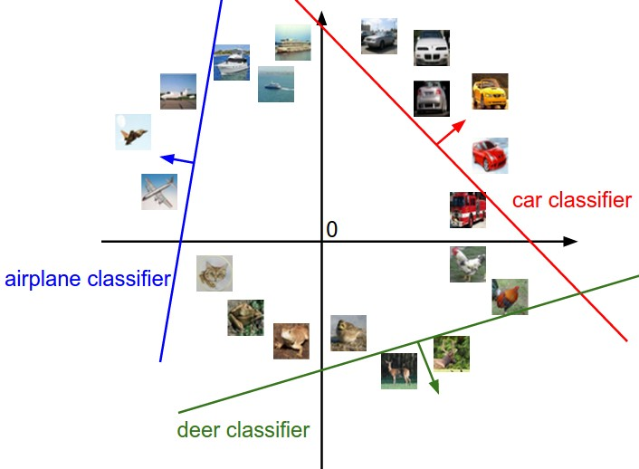
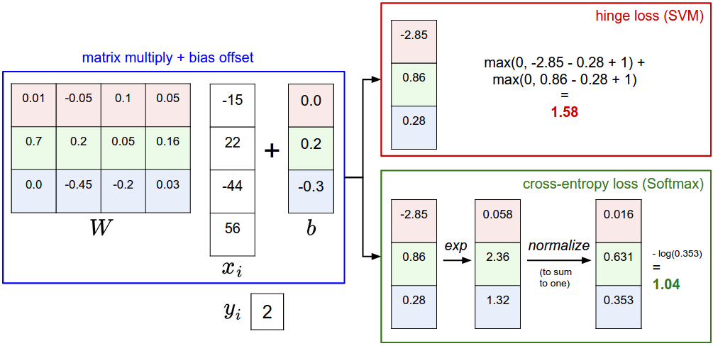
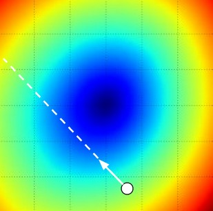
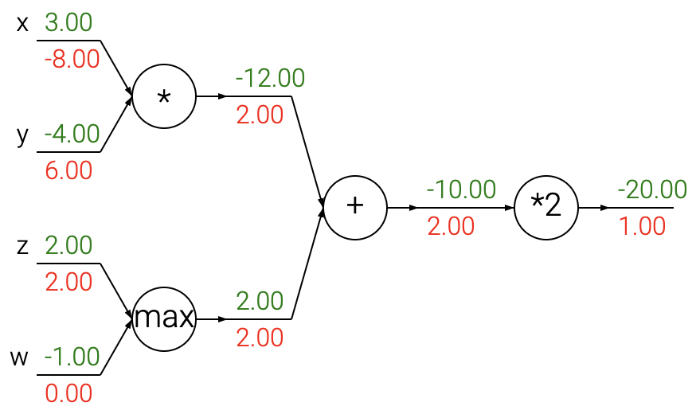

# Lecture 1: Linear Classification

**Instructor:** Fei Tan

 @econdojo &nbsp;&nbsp;&nbsp;&nbsp;  @BusinessSchool101 &nbsp;&nbsp;&nbsp;&nbsp;  Saint Louis University

**Course:** Introduction to Neural Networks  
**Date:** September 10, 2025

---

## Image Classification


---

## The Road Ahead

1. [Linear Classifiers](#linear-classifiers)
2. [Gradient Descent](#gradient-descent)  
3. [Backpropagation](#backpropagation)

---

## Score Function

**Linear score**

<div class="equation-box">

$$f(x_i,W,b)=Wx_i+b$$

</div>

**Notation**

- Dataset of $N$ examples $\{(x_i,y_i)\}_{i=1}^N$, $D$ (normalized) features $x_i\in\mathbb{R}^D$, $K$ categories of *single* attribute $y_i\in 1,\ldots,K$
- $K\times D$ weights $W$, $K\times 1$ bias $b$

**Pipeline**

- Split data into training, validation, and test sets
- Train parameters and (cross) validate hyperparameters
- Evaluate on test set only once at the end

---

## Algebraic Interpretation


---

## Geometric Interpretation



---

## Loss Function

**Regularized loss**

<div class="equation-box">

$$L=\frac{1}{N}\sum_{i}L_i+\lambda R(W),\quad \lambda>0$$

</div>

**Examples of data loss**

- Multiclass support vector machine (SVM) classifier uses hinge loss: $L_i=\sum_{j\neq y_i}\max(0,f_j-f_{y_i}+\Delta)$, $\Delta>0$
- Softmax classifier uses cross-entropy loss: $L_i=-\log\left(\frac{e^{f_{y_i}}}{\sum_je^{f_j}}\right)$

**Examples of regularization/prior**

- $L^1$ regularization: $R(W)=\sum_{i,j}|W_{ij}|$
- $L^2$ regularization: $R(W)=\sum_{i,j}W_{ij}^2$

---

## Loss Function (Cont'd)

<div class="code-box">

```python
import numpy as np

# SVM classifier
def L1_i(x_i, y_i, W, b):
    delta = 1.0
    f = W.dot(x_i) + b
    margins = np.maximum(0, f - f[y_i] + delta)
    margins[y_i] = 0  # ignore true class
    return np.sum(margins)

# Softmax classifier
def L2_i(x_i, y_i, W, b):
    f = W.dot(x_i) + b
    f -= np.max(f)    # avoid potential blowup
    p = np.exp(f) / np.sum(np.exp(f))
    return -np.log(p[y_i])
```

</div>

---

## SVM vs. Softmax



---

## Analytic Gradient

**Derivative of 1-D function**

<div class="equation-box">

$$\frac{df(x)}{dx}=\lim_{h\to 0}\frac{f(x+h)-f(x)}{h}$$

</div>

**Gradient of multi-D function**

- Vector of partial derivatives in each dimension
- Examples of 2-D function:
  - $f(x,y)=xy\quad \rightarrow\quad \nabla f=\left[\frac{\partial f}{\partial x},\frac{\partial f}{\partial y}\right]=[y,x]$
  - $f(x,y)=x+y\quad \rightarrow\quad \nabla f=[1,1]$
  - $f(x,y)=\max(x,y)\quad \rightarrow\quad \nabla f=[\mathbb{1}(x\geq y),\mathbb{1}(x\leq y)]$

---

## Numerical Gradient

<div class="code-box">

```python
import numpy as np

def num_grad(f, x):  # finite difference method
    fx = f(x)
    grad = np.zeros(x.shape)
    h = 0.00001
    it = np.nditer(x, flags=['multi_index'], op_flags=['readwrite'])
    while not it.finished:
        ix = it.multi_index
        old_value = x[ix]
        x[ix] = old_value + h
        fxh = f(x)
        x[ix] = old_value
        grad[ix] = (fxh - fx) / h # alternatively [f(x+h)-f(x-h)]/2h
        it.iternext()
    return grad
```

</div>

---

## Gradient Descent

**Repeated local search to minimize loss function**

- Update in *negative* gradient direction
- Validate learning rate (step size)

**Mini-batch/stochastic gradient descent**

<div class="code-box">

```python
while True:
    data_batch = sample_data(training_data, 256)
    weights_grad = eval_grad(loss_fun, data_batch, weights)
    weights += - step_size * weights_grad  # in-place update
```

</div>

---

## Gradient Descent (Cont'd)



---

## Backpropagation

**Chain rule**

<div class="equation-box">

$$\frac{dz}{dx}=\frac{dz}{dy}\frac{dy}{dx}$$

</div>

**Example of composite function**

$$f(v(p(x,y),q(z,w)))=2\ \underbrace{[\underbrace{xy}_{p\ (\text{$\ast$ gate})}+\quad\underbrace{\max(z,w)}_{q\ \text{(max gate)}}\quad]}_{v\ \text{(+ gate)}}$$

- Forward pass: $[x,y,z,w]=[3,-4,2,-1]$, $f=-20$
- Backward pass: $\nabla f=\left[\frac{\partial f}{\partial x},\frac{\partial f}{\partial y},\frac{\partial f}{\partial z},\frac{\partial f}{\partial w}\right]=[-8,6,2,0]$

---

## Backpropagation (Cont'd)

<div class="code-box">

```python
# Forward pass
x = 3; y = -4; z = 2; w = -1
p = x * y      # -12
q = max(z, w)  # 2
v = p + q      # -10
f = 2 * v      # -20

# Backward pass
dfdv = 2
dvdp = 1
dpdx = y
dpdy = x
dvdq = 1
dqdz = (z > w)
dqdw = (w > z)
dfdx = dfdv * dvdp * dpdx  # -8
dfdy = dfdv * dvdp * dpdy  # 6
dfdz = dfdv * dvdq * dqdz  # 2
dfdw = dfdv * dvdq * dqdw  # 0
```

</div>

---

## PyTorch Implementation

<div class="code-box">

```python
import torch

# Forward pass
x = torch.tensor(3., requires_grad=True)
y = torch.tensor(-4., requires_grad=True)
z = torch.tensor(2., requires_grad=True)
w = torch.tensor(-1., requires_grad=True)
p = x * y   # tensor(-12., grad_fn=<MulBackward0>)
q = max(z, w) # tensor(2., grad_fn=<MaxBackward0>)
v = p + q   # tensor(-10., grad_fn=<AddBackward0>)
f = 2 * v   # tensor(-20., grad_fn=<MulBackward0>)

# Backward pass
f.backward()   # compute gradients
print(x.grad)  # tensor(-8.)
print(y.grad)  # tensor(6.)
print(z.grad)  # tensor(2.)
print(w.grad)  # tensor(0.)
```

</div>

---

## PyTorch Computation Graph



---

## References

- [cs231n.stanford.edu](http://cs231n.stanford.edu) - CS231n: Deep Learning for Computer Vision
- [github.com/karpathy/micrograd](https://github.com/karpathy/micrograd) - A tiny scalar-valued autograd engine and a neural net library on top of it with PyTorch-like API  
- Tang (2013), "Deep Learning using Linear Support Vector Machines", [arXiv:1306.0239](https://arxiv.org/abs/1306.0239)
