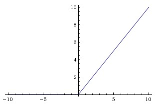
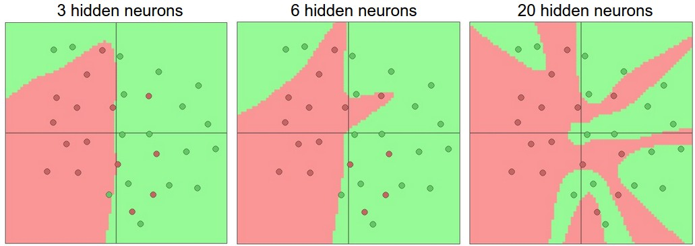
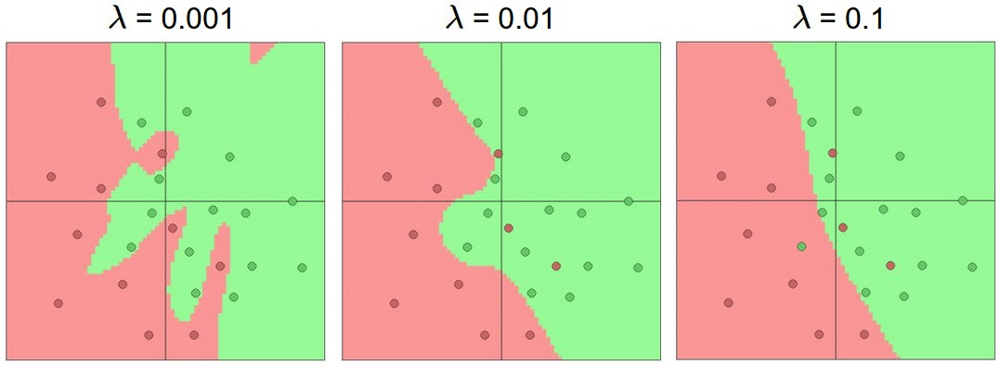
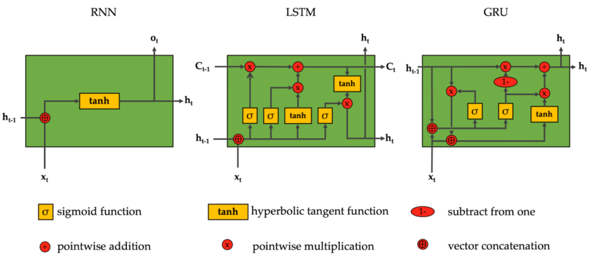
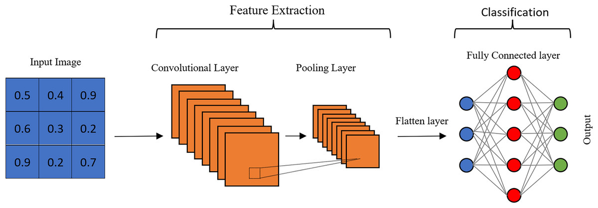
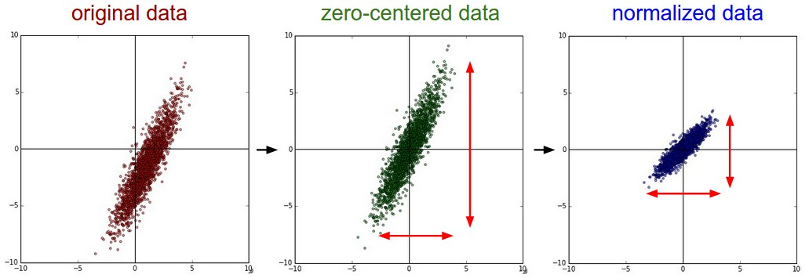
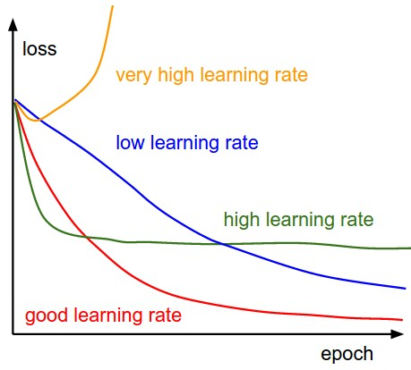
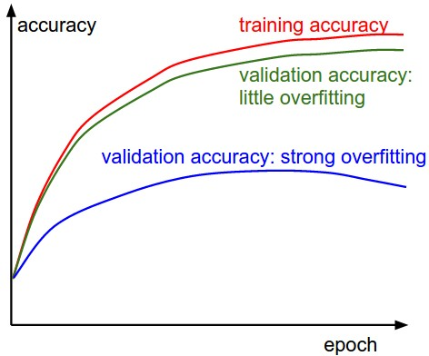
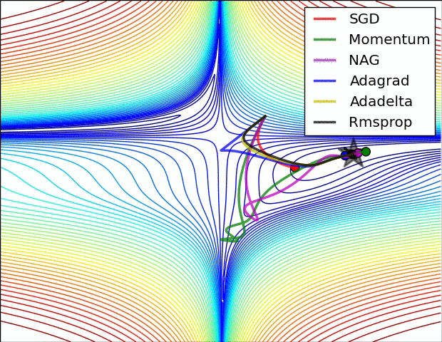
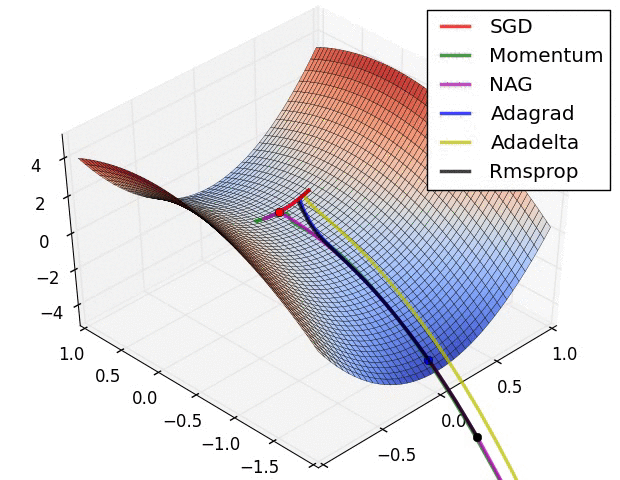

# Lecture 2: Neural Networks

**Instructor:** Fei Tan

 @econdojo &nbsp;&nbsp;&nbsp;&nbsp;  @BusinessSchool101 &nbsp;&nbsp;&nbsp;&nbsp;  Saint Louis University

**Course:** Introduction to Neural Networks  
**Date:** November 15, 2025

---

## Biological Neuron


---

## The Road Ahead

1. [Basic Architecture](#mathematical-neuron)
2. [Pre-training Processing](#data-standardization)
3. [Model Training](#diagnosis-loss-function)

---

## Mathematical Neuron


---

## Activation Functions



- Rectified Linear Unit (ReLU): $f(x)=\max(0,x)$
- Leaky ReLU: $f(x)=\max(0.01x,x)$ (avoid dying ReLU)
- Historically, sigmoid or tanh (vanishing/exploding gradient)

---

## Multilayer Perceptron


- 3-layer fully connected neural network
- Not counting input; no activation in output layer
- Why go 'deep'? (representational power)

---

## Forward Pass

<div class="code-box">

```python
import numpy as np

# Forward pass
f = lambda x: 1.0/(1.0 + np.exp(-x)) # sigmoid activation
x = np.random.randn(3, 1)   # random input vector (3x1)
h1 = f(np.dot(W1, x) + b1)  # first hidden layer activations (4x1)
h2 = f(np.dot(W2, h1) + b2) # second hidden layer activations (4x1)
out = np.dot(W3, h2) + b3   # output neuron (1x1)
```

</div>

---

## Overfitting



- In-sample fitting vs. out-of-sample generalization
- How to control overfitting?

---

## Regularization



- $L^1$, $L^2$, max-norm, and dropout to control overfitting
- Regularization/prior from structural models

---

## Variant: Recurrent Neural Net



---

## Variant: Convolutional Neural Net



---

## Data Standardization



- Mean subtraction + normalization by s.d. (or principal component, whitening)

    <div class="code-box">

    ```python
    X -= np.mean(X, axis = 0) # X is of N examples x D features; in-place broadcasting
    X /= np.std(X, axis = 0)
    ```

    </div>

- Apply *only* on training set, then on validation/test set

---

## Weight Initialization

- Avoid all-zero initialization, use small random numbers to break symmetry

    <div class="code-box">

    ```python
    W = 0.01 * np.random.randn(D,H)       # randn samples from standard Gaussian
    b = np.zeros((1,H))                   # bias
    w = np.random.randn(n) / sqrt(n)      # normalization; n = number of inputs
    w = np.random.randn(n) * sqrt(2.0/n)  # ReLU neurons
    ```

    </div>

- Batch/layer normalization + residual connection to stabilize learning

---

## Diagnosis: Loss Function



---

## Diagnosis: Accuracy



---

## Other Diagnoses

- Ratio of update to weight magnitudes ($\sim 10^{-3}$)

    <div class="code-box">

    ```python
    # Parameter vector W and gradient vector dW
    param_scale = np.linalg.norm(W.ravel())
    update = -learning_rate*dW       # SGD update
    update_scale = np.linalg.norm(update.ravel())
    W += update
    print update_scale / param_scale # about 1e-3
    ```

    </div>

- Activation/gradient distribution per layer

---

## Non-adaptive Learning

- Nesterov momentum update

    <div class="code-box">

    ```python
    v_prev = v                       # back up
    v = mu * v - learning_rate * dx  # velocity update; mu = 0.9
    x += -mu * v_prev + (1 + mu) * v # position update
    ```

    </div>

- Anneal learning rate over time

- Newton's second-order method

    <div class="equation-box">

    $$x_{k+1} = x_k - \left(\nabla^2 f(x_k)\right)^{-1}\nabla f(x_k)$$

    </div>

    - expensive to compute and inverse Hessian $\nabla^2 f(x)$
    - Quasi-Newton method, e.g. L-BFGS

---

## Adaptive Learning

- Adagrad/RMSprop

    <div class="code-box">

    ```python
    cache += dx**2  # Adagrad
    cache = decay_rate * cache + (1 - decay_rate) * dx**2     # RMSprop; decay_rate = 0.99
    x += - learning_rate * dx / (np.sqrt(cache) + eps)
    ```

    </div>

- Adam (recommended)

    <div class="code-box">

    ```python
    m = beta1*m + (1-beta1)*dx  # beta1 = 0.9
    mt = m / (1-beta1**t)       # bias correction; t = iter counter
    v = beta2*v + (1-beta2)*(dx**2) # beta2 = 0.999
    vt = v / (1-beta2**t)
    x += -learning_rate * mt / (np.sqrt(vt) + eps)
    ```

    </div>

---

## Learning Dynamics



---

## Learning Dynamics (Cont'd)



---

## Need for Speed

- Choosing right device

    - central Processing Unit (CPU)
    - graphics Processing Unit (GPU) (NVIDIA's CUDA, AMD's ROCm, Apple's MPS)

- Mixed precision training

    - half-precision floating point (FP16)
    - brain floating point (BF16)
    - quarter-precision floating point (FP8)

- PyTorch distributed data parallel (DDP)

---

## Miscellaneous Pointers

- Gradient check with small batch of data
- Prefer larger networks with proper regularization
- For continuous and multivariate outcome space, *discretize* and train *independently* for each attribute
- Random search for good hyperparameters
- Form model ensemble for extra performance

---

## References

- [cs231n.stanford.edu](http://cs231n.stanford.edu) - CS231n: Deep Learning for Computer Vision
- Ioffe & Szegedy (2015), "Batch Normalization: Accelerating Deep Network Training by Reducing Internal Covariate Shift", [arXiv:1502.03167](https://arxiv.org/abs/1502.03167)
- Ba, Kiros & Hinton (2016), "Layer Normalization", [arXiv:1607.06450](https://arxiv.org/abs/1607.06450)
- He et al. (2015), "Deep Residual Learning for Image Recognition", [arXiv:1512.03385](https://arxiv.org/abs/1512.03385)
- Srivastava et al. (2014), "Dropout: A Simple Way to Prevent Neural Networks from Overfitting", *Journal of Machine Learning Research*
