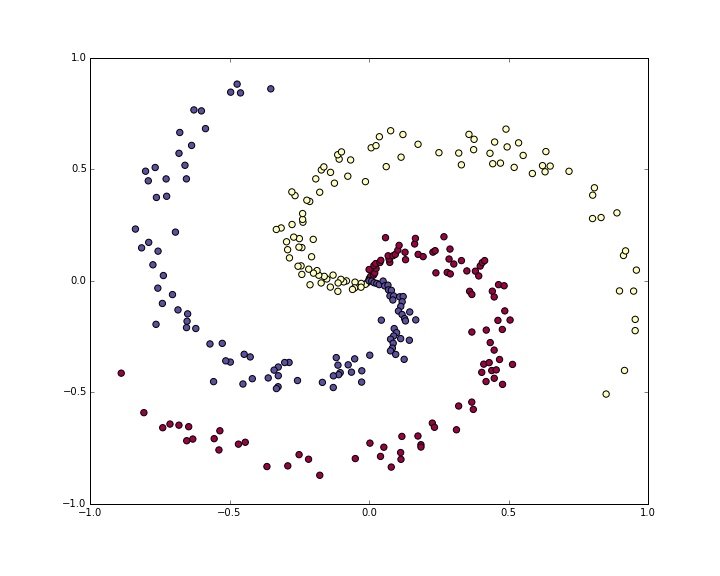
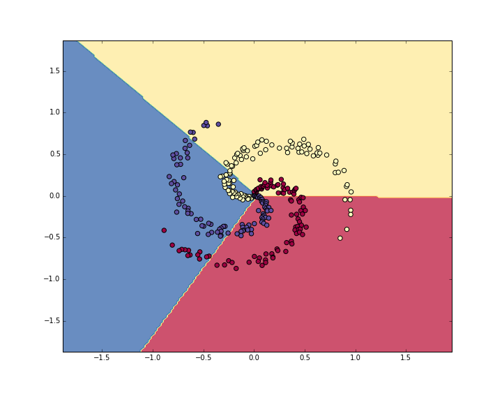
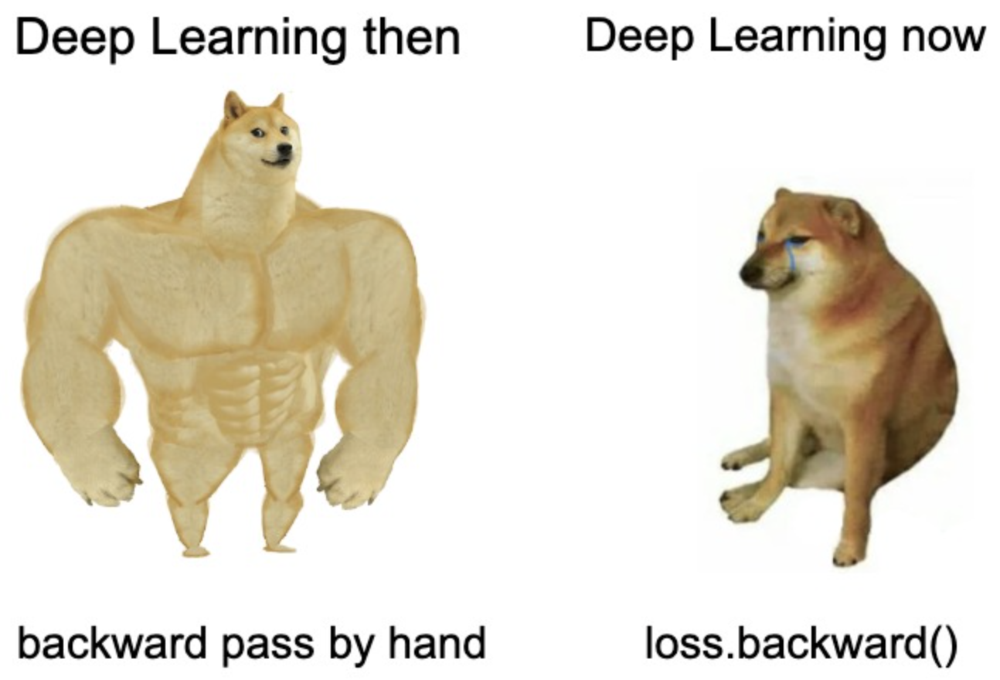

# Lecture 3: A Minimal Case Study

**Instructor:** Fei Tan

 @econdojo &nbsp;&nbsp;&nbsp;&nbsp;  @BusinessSchool101 &nbsp;&nbsp;&nbsp;&nbsp;  Saint Louis University

**Course:** Introduction to Neural Networks  
**Date:** November 15, 2025

---

## Nonlinear Classification



---

## The Road Ahead

1. [Training Softmax Classifier](#throwback)
2. [Training Neural Network](#forward-backward-pass)
3. [Becoming Backprop Ninja](#deep-learning-then-vs-now)

---

## Throwback

**$L^2$ regularized loss**

<div class="equation-box">

$$L=\frac{1}{N}\sum_{i}L_i+\frac{1}{2}\lambda\sum_{i,j}W_{ij}^2$$

</div>

- Softmax classifier
  - Linear score: $f(x_i,W,b)=Wx_i+b$
  - Cross-entropy loss: $L_i=-\log(p_{y_i})$, $p_k=\frac{e^{f_k}}{\sum_je^{f_j}}$

- Backpropagation

    $$\frac{\partial L}{\partial W_{k\cdot}}=\frac{1}{N}\sum_{i}\underbrace{\frac{\partial L_i}{\partial f_k}}_{p_k-\mathbb{1}(y_i=k)}\underbrace{\frac{\partial f_k}{\partial W_{k\cdot}}}_{x_i'}+\lambda W_{k\cdot}$$

---

## Forward-Backward Pass

<div class="code-box">

```python
import numpy as np

# Forward pass
exp_scores = np.exp(np.dot(X, W) + b)
probs = exp_scores / np.sum(exp_scores, axis=1, keepdims=True)
correct_logprobs = -np.log(probs[range(num_examples), y])
loss = np.sum(correct_logprobs) / num_examples + 0.5 * reg * np.sum(W * W)

# Backward pass
probs[range(num_examples),y] -= 1
dscores = probs / num_examples
dW = np.dot(X.T, dscores)
db = np.sum(dscores, axis=0, keepdims=True)
dW += reg*W
```

</div>

---

## Softmax Classifier



---

## Forward-Backward Pass

<div class="code-box">

```python
# Forward pass
hidden_layer = np.maximum(0, np.dot(X, W) + b)
scores = np.dot(hidden_layer, W2) + b2

# Backward pass
dW2 = np.dot(hidden_layer.T, dscores)
db2 = np.sum(dscores, axis=0, keepdims=True)
dhidden = np.dot(dscores, W2.T)
dhidden[hidden_layer <= 0] = 0  # ReLU
dW = np.dot(X.T, dhidden)
db = np.sum(dhidden, axis=0, keepdims=True)
```

</div>

---

## Neural Network


---

## PyTorch Implementation

<div class="code-box">

```python
import torch
import torch.nn as nn
import torch.optim as optim

X_tensor = torch.tensor(X, dtype=torch.float32)
y_tensor = torch.tensor(y, dtype=torch.long)

class SimpleNN(nn.Module):
    def __init__(self, D, h, K):
        super(SimpleNN, self).__init__()
        self.fc1 = nn.Linear(D, h)
        self.relu = nn.ReLU()
        self.fc2 = nn.Linear(h, K)
    
    def forward(self, x):
        x = self.fc1(x)
        x = self.relu(x)
        x = self.fc2(x)
        return x
```

</div>

---

## PyTorch Implementation (Cont'd)

<div class="code-box">

```python
# Initialization
model = SimpleNN(D, h, K)
criterion = nn.CrossEntropyLoss()
optimizer = optim.SGD(model.parameters(), lr=1e-0, weight_decay=1e-3)

# Training
for epoch in range(num_epochs):
    # Forward pass
    scores = model(X_tensor)
    loss = criterion(scores, y_tensor)
    optimizer.zero_grad()  # zero grad!

    # Backward pass
    loss.backward()
    optimizer.step()
```

</div>

---

## Deep Learning Then vs. Now



---

## Bonus Question

- Consider vanilla neural network

    $$z_i^{(l)} = B^{(l)}a_i^{(l-1)}+b^{(l)},\quad l=1,\ldots,L+1$$

    $$a_i^{(l)} = \max(0,z_i^{(l)}),\quad l=1,\ldots,L$$

    with parameters

    $$\beta = [\beta^{(1)'},b^{(1)'},\ldots,\beta^{(L+1)'},b^{(L+1)'}]',\quad \beta^{(l)}=\text{vec}(B^{(l)'})$$

- Prove backprop recursion

    $$V_i^{(l)} = \frac{\partial z_i^{(L+1)}}{\partial b^{(l)'}}=V_i^{(l+1)}B^{(l+1)}D_i^{(l)},\quad D_i^{(l)}=\frac{\partial a_i^{(l)}}{\partial z_i^{(l)'}}$$

    $$U_i^{(l)} = \frac{\partial z_i^{(L+1)}}{\partial \beta^{(l)'}}=V_i^{(l)}(I\otimes a_i^{(l-1)'}),\quad l=1,\ldots,L$$

---

## References

- [cs231n.stanford.edu](http://cs231n.stanford.edu) - CS231n: Deep Learning for Computer Vision
- Nielsen, Michael - "A visual proof that neural nets can compute any function" [link](http://neuralnetworksanddeeplearning.com/chap4.html)
- Yang, Edward - "PyTorch internals" [link](http://blog.ezyang.com/2019/05/pytorch-internals)
