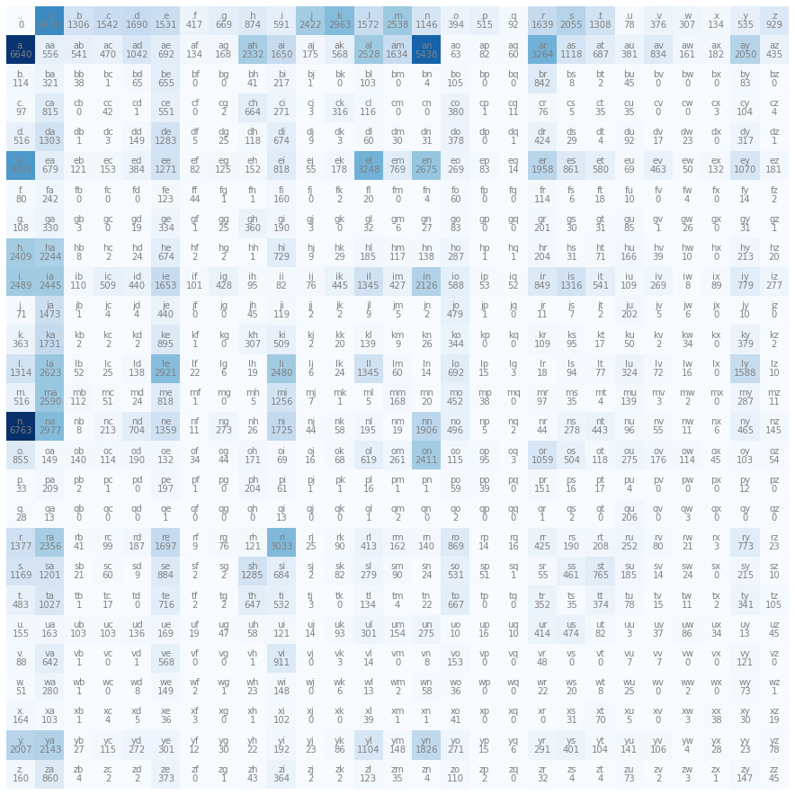
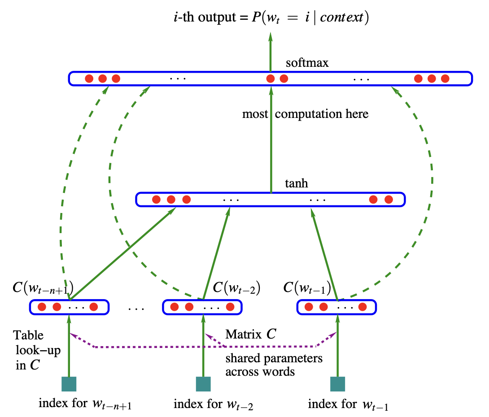
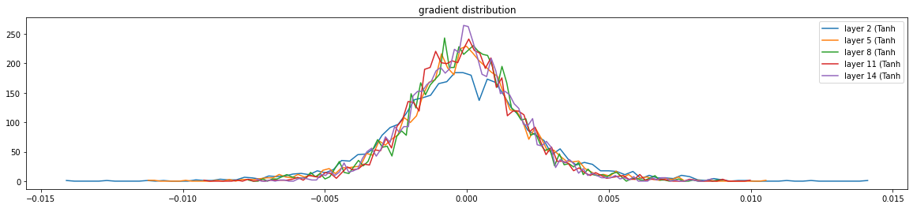
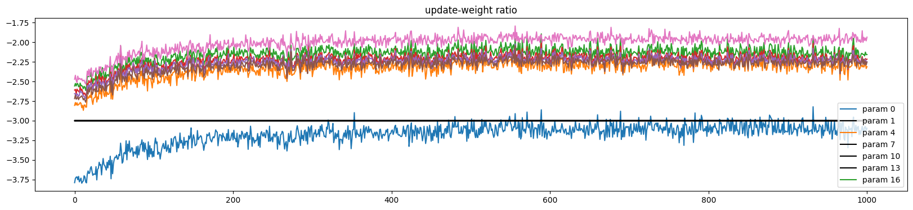
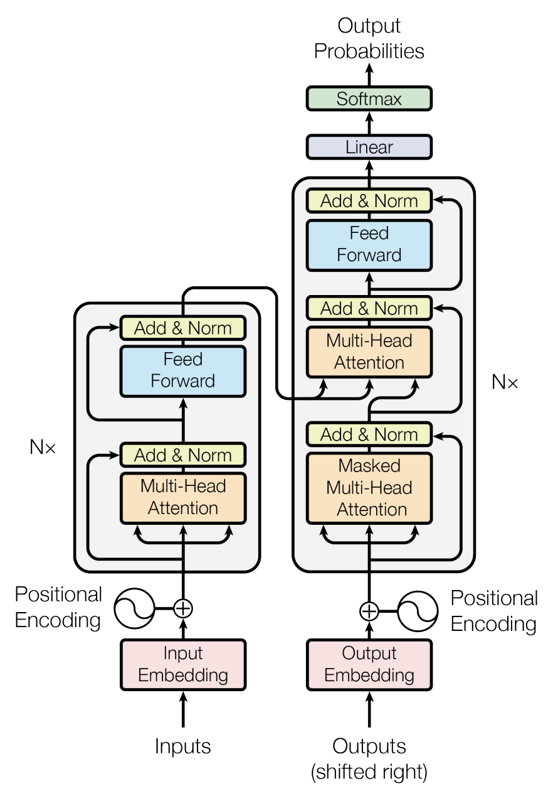
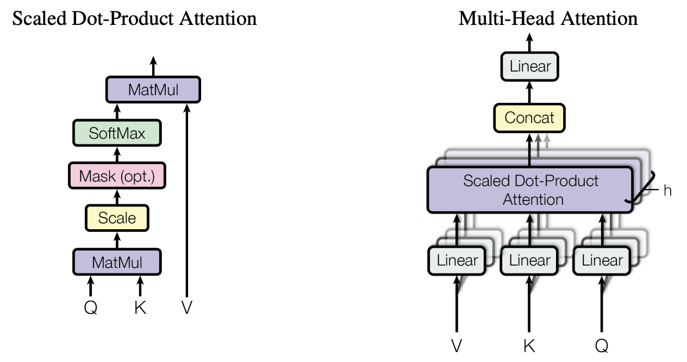

# Lecture 4: Language Modeling

**Instructor:** Fei Tan

 @econdojo &nbsp;&nbsp;&nbsp;&nbsp;  @BusinessSchool101 &nbsp;&nbsp;&nbsp;&nbsp;  Saint Louis University

**Course:** Introduction to Neural Networks  
**Date:** November 15, 2025

---

## Makemore

- Autoregressive character-level language model

  - input: a text file of words
  - output: similar words as input

- Application to name generation

  <div class="code-box">

  ```bash
  # Input: 32K common names from ssa.gov in 2018
  $ python makemore.py -i names.txt -o names
  
  # Output: name-like words
  dontell
  khylum
  camatena
  aeriline
  najlah
  sherrith
  ```

  </div>

---

## The Road Ahead

1. [Bigram](#bigram-counts)
2. [Multilayer Perceptron](#model-architecture)
3. [Transformer](#model-architecture-1)

---

## Bigram Counts



---

## Preprocessing

<div class="code-box">

```python
import torch

# Training dataset
xs, ys = [], []
for w in words:      # list of names
    chs = ['.'] + list(w) + ['.']
    for ch1, ch2 in zip(chs, chs[1:]):
        ix1 = stoi[ch1]  # char to index
        ix2 = stoi[ch2]
        xs.append(ix1)
        ys.append(ix2)
xs = torch.tensor(xs)
ys = torch.tensor(ys)

# Weight initialization
g = torch.Generator().manual_seed(2147483647)
W = torch.randn((27, 27), generator=g, requires_grad=True)
```

</div>

---

## Training

<div class="code-box">

```python
import torch.nn.functional as F

# Gradient descent (maximum likelihood estimation)
for k in range(10000):
    # Forward pass
    xenc = F.one_hot(xs, num_classes=27).float() # one-hot encoding
    logits = xenc @ W  # softmax classifier
    counts = logits.exp()
    probs = counts / counts.sum(1, keepdims=True)
    loss = -probs[torch.arange(num), ys].log().mean() + 0.01*(W**2).mean()
    print(loss.item())
    
    # Backward pass
    W.grad = None      # zero gradients
    loss.backward()
    W.data += -0.1 * W.grad
```

</div>

---

## Prediction

<div class="code-box">

```python
# Sampling
for i in range(5):
    out = []
    ix = 0
    while True:
        xenc = F.one_hot(torch.tensor([ix]), num_classes=27).float()
        logits = xenc @ W
        counts = logits.exp()
        p = counts / counts.sum(1, keepdims=True)
        ix = torch.multinomial(p, num_samples=1, 
                               replacement=True, generator=g).item()
        out.append(itos[ix])
        if ix == 0:
            break
    print(''.join(out))  # mor. axx. minaymoryles. kondlaisah. anchthizarie.
```

</div>

---

## Model Architecture



---

## PyTorch-Like API

<div class="code-box">

```python
class Linear:  # torch.nn.Linear
    def __init__(self, fan_in, fan_out, bias=True):
        self.weight = torch.randn((fan_in, fan_out), generator=g)
        self.bias = torch.zeros(fan_out) if bias else None
    
    def __call__(self, x):
        self.out = x @ self.weight
        if self.bias is not None:
            self.out += self.bias
        return self.out
    
    def parameters(self):
        return [self.weight] + ([] if self.bias is None else [self.bias])

class Tanh:    # torch.nn.Tanh
    def __call__(self, x):
        self.out = torch.tanh(x)
        return self.out
```

</div>

---

## PyTorch-Like API (Cont'd)

<div class="code-box">

```python
class BatchNorm1d:  # torch.nn.BatchNorm1d
    def __init__(self, dim, eps=1e-5, momentum=0.1):
        self.eps = eps
        self.momentum = momentum
        self.training = True
        # Trained with backprop
        self.gamma = torch.ones(dim)
        self.beta = torch.zeros(dim)
        # Trained with running momentum update
        self.running_mean = torch.zeros(dim)
        self.running_var = torch.ones(dim)

    def parameters(self):
        return [self.gamma, self.beta]
```

</div>

---

## PyTorch-Like API (Cont'd)

<div class="code-box">

```python
class BatchNorm1d:  # torch.nn.BatchNorm1d (continued)
    def __call__(self, x):
        if self.training:
            xmean = x.mean(0, keepdim=True)
            xvar = x.var(0, keepdim=True)
        else:
            xmean = self.running_mean
            xvar = self.running_var
        xhat = (x - xmean) / torch.sqrt(xvar + self.eps)
        self.out = self.gamma * xhat + self.beta
        if self.training:
            with torch.no_grad():
                self.running_mean = (1 - self.momentum) * self.running_mean + self.momentum * xmean
                self.running_var = (1 - self.momentum) * self.running_var + self.momentum * xvar
        return self.out
```

</div>

---

## Preprocessing

<div class="code-box">

```python
for w in words:
    context = [0] * block_size
    for ch in w + '.':
        ix = stoi[ch]
        X.append(context)
        Y.append(ix)
        context = context[1:] + [ix]   # shift
X = torch.tensor(X)
Y = torch.tensor(Y)

C = torch.randn((vocab_size, n_embd), generator=g)
layers = [
    Linear(n_embd * block_size, n_hidden, bias=False), 
    BatchNorm1d(n_hidden), Tanh(),
    Linear(n_hidden, n_hidden, bias=False), 
    BatchNorm1d(n_hidden), Tanh(),
    ...
    Linear(n_hidden, vocab_size, bias=False), 
    BatchNorm1d(vocab_size)]
```

</div>

---

## Training

<div class="code-box">

```python
for i in range(200000):
    # Forward pass
    ix = torch.randint(0, X.shape[0], (batch_size,))  # minibatch
    emb = C[X[ix]]
    x = emb.view(emb.shape[0], -1) # concatenate
    for layer in layers:
        x = layer(x)
    loss = F.cross_entropy(x, Y[ix])
    
    # Backward pass
    for layer in layers:
        layer.out.retain_grad()    # debug
    for p in parameters:
        p.grad = None
    loss.backward()
    lr = 0.1 if i < 100000 else 0.01
    for p in parameters:
        p.data += -lr * p.grad
```

</div>

---

## Prediction

<div class="code-box">

```python
for _ in range(5):
    out = []
    context = [0] * block_size
    while True:
        emb = C[torch.tensor([context])]
        x = emb.view(emb.shape[0], -1)
        for layer in layers:
            x = layer(x)
        probs = F.softmax(x, dim=1)
        ix = torch.multinomial(probs, num_samples=1, generator=g).item()
        context = context[1:] + [ix]
        out.append(ix)
        if ix == 0:
            break
    print(''.join(itos[i] for i in out))  
    # carpah. qarlileif. jmrix. thty. sacansa.
```

</div>

---

## Diagnoses






---

## Loss Trace (log10)


---

## Character Embeddings


---

## Model Architecture



---

## Attention

<div class="equation-box">

$$\text{Attention}(Q, K, V) = \text{softmax}\left(\frac{QK^T}{\sqrt{d_k}}\right) V$$

</div>

- Key concepts

  - *query* ($Q$) represents current word, *key* ($K$) captures other words, *value* ($V$) carries information
  - encoder vs. decoder, self-attention vs. cross-attention

- Why attention mechanism?

  - eliminate need for recurrence or convolution
  - superior performance while maintaining parallelization

---

## Attention (Cont'd)



---

## Single-Head Attention

<div class="code-box">

```python
class Head(nn.Module):
    def __init__(self, head_size):
        super().__init__()
        self.key = nn.Linear(n_embd, head_size, bias=False)
        self.query = nn.Linear(n_embd, head_size, bias=False)
        self.value = nn.Linear(n_embd, head_size, bias=False)
        self.register_buffer('tril', 
            torch.tril(torch.ones(block_size, block_size)))
        self.dropout = nn.Dropout(dropout)
```

</div>

---

## Single-Head Attention (Cont'd)

<div class="code-box">

```python
class Head(nn.Module):
    def forward(self, x):
        B, T, C = x.shape # (batch, time, channels)
        k = self.key(x)
        q = self.query(x)
        wei = q @ k.transpose(-2,-1) * k.shape[-1]**-0.5  # attention scores
        wei = wei.masked_fill(self.tril[:T, :T] == 0, float('-inf'))
        wei = F.softmax(wei, dim=-1)
        wei = self.dropout(wei)
        v = self.value(x)
        out = wei @ v   # (batch, time, head size)
        return out
```

</div>

---

## Multi-Head Attention

<div class="code-box">

```python
class MultiHead(nn.Module):
    def __init__(self, num_heads, head_size):
        super().__init__()
        self.heads = nn.ModuleList([Head(head_size) 
                                    for _ in range(num_heads)])
        self.proj = nn.Linear(head_size * num_heads, n_embd)
        self.dropout = nn.Dropout(dropout)

    def forward(self, x):
        out = torch.cat([h(x) for h in self.heads], dim=-1)
        out = self.dropout(self.proj(out))
        return out
```

</div>

---

## Feed Forward

<div class="code-box">

```python
class FeedFoward(nn.Module):
    def __init__(self, n_embd):
        super().__init__()
        self.net = nn.Sequential(
            nn.Linear(n_embd, 4 * n_embd),
            nn.ReLU(),
            nn.Linear(4 * n_embd, n_embd),
            nn.Dropout(dropout))

    def forward(self, x):
        return self.net(x)
```

</div>

---

## Transformer Block

<div class="code-box">

```python
class Block(nn.Module):
    def __init__(self, n_embd, n_head):
        super().__init__()
        head_size = n_embd // n_head
        self.sa = MultiHeadAttention(n_head, head_size)
        self.ffwd = FeedFoward(n_embd)
        self.ln1 = nn.LayerNorm(n_embd)
        self.ln2 = nn.LayerNorm(n_embd)

    def forward(self, x):
        x = x + self.sa(self.ln1(x))
        x = x + self.ffwd(self.ln2(x))
        return x
```

</div>

---

## GPT

<div class="code-box">

```python
class GPT(nn.Module):
    def __init__(self):
        super().__init__()
        self.token_embedding_table = nn.Embedding(vocab_size, n_embd)
        self.position_embedding_table = nn.Embedding(block_size, n_embd)
        self.blocks = nn.Sequential(*[Block(n_embd, n_head=n_head) 
                                      for _ in range(n_layer)])
        self.ln_f = nn.LayerNorm(n_embd)
        self.lm_head = nn.Linear(n_embd, vocab_size)
```

</div>

---

## GPT (Cont'd)

<div class="code-box">

```python
class GPT(nn.Module):
    def forward(self, idx, targets):
        B, T = idx.shape
        tok_emb = self.token_embedding_table(idx)
        pos_emb = self.position_embedding_table(torch.arange(T))
        x = tok_emb + pos_emb
        x = self.blocks(x)
        x = self.ln_f(x)
        logits = self.lm_head(x)
        B, T, C = logits.shape
        logits = logits.view(B*T, C)
        targets = targets.view(B*T)
        loss = F.cross_entropy(logits, targets)
        return logits, loss

device = torch.device("mps" if torch.backends.mps.is_available() else "cpu")
model = GPT().to(device)
```

</div>

---

## Prediction

<div class="code-box">

```bash
# Input: Shakespeare's texts
# wget https://raw.githubusercontent.com/karpathy/char-rnn/master/
#      data/tinyshakespeare/input.txt

First Citizen:
Before we proceed any further, hear me speak.

All:
Speak, speak.

# Output: Shakespeare-like text

VALHASINA:
Nobleman; go, then both groans to us.

AUFIDIUS:
O those prepation!
```

</div>

---

## Tokenizer

- Byte-pair encoding for tokenizing text

  - iteratively replace most frequent pair of consecutive UTF-8 bytes (characters) with single byte
  - reduce vocabulary while being able to encode *any* word

- Example: "aaabdaaabac" → "XdXac", X=ZY, Y=ab, Z=aa

  <div class="code-box">

  ```python
  from minbpe import BasicTokenizer
  tokenizer = BasicTokenizer()
  text = "aaabdaaabac"
  tokenizer.train(text, 256 + 3)  # 256 byte tokens + 3 merges
  print(tokenizer.encode(text))   # [258, 100, 258, 97, 99]
  print(tokenizer.decode([258, 100, 258, 97, 99]))  # aaabdaaabac
  ```

  </div>

---

## References

- [github.com/karpathy/makemore](https://github.com/karpathy/makemore) - An autoregressive character-level language model for making more things
- [github.com/karpathy/nanoGPT](https://github.com/karpathy/nanoGPT) - The simplest, fastest repository for training/finetuning medium-sized GPTs
- [github.com/karpathy/minbpe](https://github.com/karpathy/minbpe) - Minimal, clean code for the Byte Pair Encoding (BPE) algorithm commonly used in LLM tokenization
- Bengio et al. (2003), "A Neural Probabilistic Language Model", *Journal of Machine Learning Research*
- Vaswani et al. (2017), "Attention is All You Need", [arXiv:1706.03762](https://arxiv.org/abs/1706.03762)
